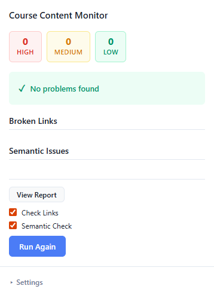
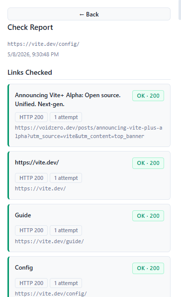

# Course Content Monitor (CCM)

A Chrome extension that checks the active browser tab for broken links and semantically outdated content. Built for course authors and technical writers who need to keep learning material accurate and up to date.





---

## Features

- **Link checking** — scans every link on the page and reports broken ones, with HTTP status codes, retry counts, and soft-404 detection (e.g. GitHub pages that return 200 but display "Not Found")
- **Semantic check** — sends the page text to an LLM via [OpenRouter](https://openrouter.ai) and flags sections that may be outdated: deprecated APIs, renamed UI flows, stale version numbers, changed pricing, etc.
- **Selective checks** — run both checks together, or choose links-only or semantic-only from the popup
- **Severity badges** — issues are classified as High, Medium, or Low so you can triage quickly
- **Fix suggestions** — each broken link and outdated section includes a suggested action
- **Full report view** — drill into every link result (status code, attempt count, soft-404 verdict) and the character coverage sent to the LLM
- **Stale-check detection** — if the background worker is interrupted, the popup surfaces a clear "run again" prompt instead of spinning forever

---

## Installation

The extension is not published to the Chrome Web Store. Load it as an unpacked extension:

1. Clone the repository and install dependencies:

   ```bash
   git clone ccm
   cd ccm
   npm install
   ```

2. Build the extension:

   ```bash
   npm run build
   ```

3. Open Chrome and navigate to `chrome://extensions`.
4. Enable **Developer mode** (top-right toggle).
5. Click **Load unpacked** and select the `dist/` folder.

The extension icon will appear in the toolbar.

---

## Configuration

The semantic check requires an [OpenRouter](https://openrouter.ai) API key.

1. Click the extension icon to open the popup.
2. Expand the **Settings** panel at the bottom.
3. Paste your OpenRouter API key and click **Save**.

The key is stored locally in `chrome.storage.local` and never leaves your device except in requests to the OpenRouter API.

The default model is `nvidia/nemotron-3-nano-omni-30b-a3b-reasoning:free`. You can change it by editing `src/semanticChecker.js`.

---

## Usage

1. Navigate to the course page you want to check.
2. Click the extension icon.
3. Select which checks to run (Links, Semantic, or both).
4. Click **Run Check**.

The popup shows progress through three phases — extracting page data, checking links, and running the semantic check — then displays a summary of issues grouped by severity.

Click **View Report** for a detailed breakdown of every link result and the full list of flagged sections.

---

## How it works

```
Popup → background service worker → content script (page extraction)
                                  → link checker (parallel HEAD/GET fetches)
                                  → semantic checker (OpenRouter LLM call)
                                  → fix suggestion generator
```

- **Content script** (`content.js`) — injected into every page; extracts all links and visible text on request
- **Background service worker** (`background.js`) — orchestrates the pipeline; all network I/O runs here
- **Link checker** (`src/linkChecker.js`) — checks links in parallel with a global concurrency cap (10) and a per-domain cap (2); falls back from HEAD to GET on 405/403/404/429; retries once on timeout
- **Semantic checker** (`src/semanticChecker.js`) — truncates page text to a 12 000-token limit, builds a structured prompt, calls the OpenRouter chat completions API, and validates the JSON response (including a hallucination guard that discards any flagged excerpt not found verbatim in the original text)
- **Popup** (`popup/popup.js`) — reads `checkState` from `chrome.storage.local` and re-renders on every change; no polling

---

## Working with Worktrees (Worktrunk)

This project includes a [Worktrunk](https://worktrunk.dev/worktrunk/) config at `.config/wt.toml`. Worktrunk is a CLI that makes git worktrees as easy as branches — useful for running parallel feature branches or AI agents without them stepping on each other.

### Install Worktrunk

**macOS / Linux (Homebrew):**

```bash
brew install worktrunk && wt config shell install
```

**Windows (Winget):**

```bash
winget install max-sixty.worktrunk
git-wt config shell install
```

Shell integration is required so `wt switch` can change your working directory.

### Start a new worktree

```bash
wt switch --create my-feature
```

This creates a new branch and a matching worktree directory, then switches into it. The project config automatically runs `npm install` on start, so dependencies are ready immediately.

### Common commands

| Task                                | Command                       |
| ----------------------------------- | ----------------------------- |
| Create and switch to a new worktree | `wt switch --create <branch>` |
| Switch to an existing worktree      | `wt switch <branch>`          |
| List all worktrees with status      | `wt list`                     |
| Merge and clean up                  | `wt merge main`               |
| Remove current worktree             | `wt remove`                   |

### Project config

`.config/wt.toml` defines a `pre-start` hook:

```toml
[pre-start]
install = "npm install"
```

This runs `npm install` automatically whenever a worktree is created or started, so you never need to remember to install dependencies after switching branches.

---

## Development

```bash
# Run tests (single pass)
npm test

# Run tests in watch mode
npm run test:watch

# Build for production
npm run build
```

Tests use [Vitest](https://vitest.dev) with [jsdom](https://github.com/jsdom/jsdom) and [fast-check](https://fast-check.dev) for property-based tests. Test files live in `src/__tests__/`.

Linting runs automatically on staged files via Husky + lint-staged (`eslint --fix` for JS, `prettier --write` for JSON/CSS/Markdown).

---

## Permissions

| Permission                     | Why                                          |
| ------------------------------ | -------------------------------------------- |
| `activeTab`                    | Read the URL of the current tab              |
| `scripting`                    | Inject the content script                    |
| `storage`                      | Persist check state and the API key          |
| `tabs`                         | Query the active tab from the service worker |
| `host_permissions: <all_urls>` | Fetch arbitrary URLs during link checking    |

---

## Project structure

```
├── background.js          # Service worker — pipeline orchestration
├── content.js             # Content script — page extraction
├── manifest.json          # Extension manifest (MV3)
├── popup/
│   ├── popup.html         # Popup UI
│   ├── popup.js           # Popup logic and rendering
│   └── popup.css          # Popup styles
├── src/
│   ├── linkChecker.js     # Link reachability checker
│   ├── semanticChecker.js # LLM-based semantic checker
│   ├── fixSuggestions.js  # Fix suggestion generator
│   ├── pageExtractor.js   # Page extraction utilities
│   ├── tokenizer.js       # Token counting (cl100k_base)
│   ├── types.js           # JSDoc type definitions
│   └── __tests__/         # Vitest test suite
├── icons/                 # Extension icons
└── dist/                  # Built output (generated by `npm run build`)
```

---

## Roadmap

- [ ] Move API key to a backend proxy
- [ ] Publish to the Chrome Web Store
- [ ] Publish to the Firefox Add-ons store (AMO)
- [ ] Extend semantic link checking logic
- [ ] SaaS — batch link checking
- [ ] SaaS — course material upload and analysis

---

## License

ISC
